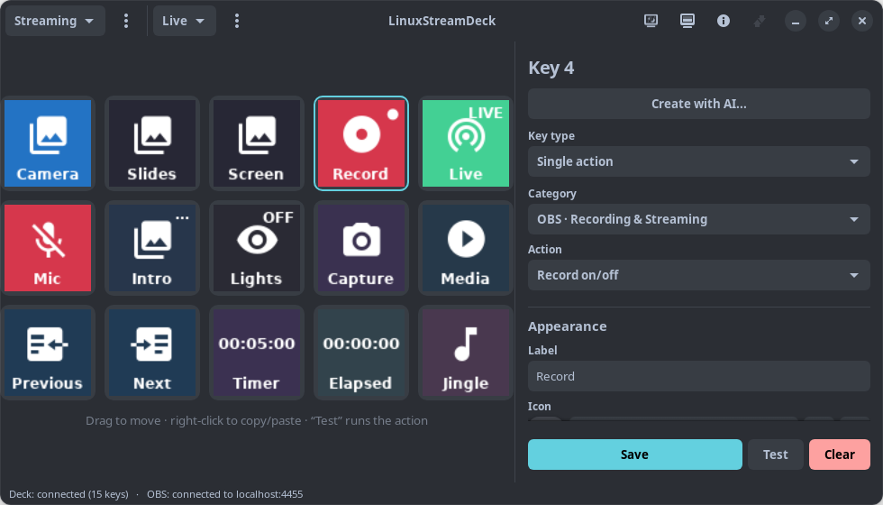

<div align="center">

# 🎛️ LinuxStreamDeck

### Your Elgato Stream Deck, finally at home on Linux — with deep OBS Studio integration.




</div>

---

Point-and-click control of your **Elgato Stream Deck** on Linux, built around **full OBS
Studio integration** (obs-websocket v5) with **live feedback right on the keys** — the
recording key turns red, the go-live key glows green, a muted mic is marked, the active
scene lights up. Configure everything from a clean GTK4 app, with a **built-in library of
~7,400 icons** so you never have to hunt for images.

## ✨ Why LinuxStreamDeck?

The Stream Deck is a fantastic little device — but Elgato only ships software for macOS
and Windows. The Linux community has built some genuinely great open-source projects to
fill that gap, and they deserve credit. In my own testing, though, I kept hitting tools
that were either fiddly to set up or missing the OBS features I actually reach for day to
day.

So this is my take on the problem: something that **just works out of the box**, is
**genuinely easy to configure**, and **covers OBS deeply** — including a "raw request"
escape hatch that exposes 100% of the obs-websocket protocol when you need it. No half-
implemented actions, no guessing. It runs, and it's useful.

## 🚀 Features

- 🎬 **Deep OBS integration** — more complete than most Linux alternatives (see below).
- 🔴 **Real-time feedback on the keys** — active scene highlighted, recording in red,
  streaming in green, muted mic marked… straight from obs-websocket events.
- 🗂️ **Profiles & pages** — each profile keeps its own set of pages and keys; switch
  between "Streaming", "Work", "Gaming" in one click. Rename, delete, describe,
  or assign keys to move directly, forward or backward through that profile.
- 🧩 **Three key types** — *single action*, *multiple actions* (run in sequence, with an
  optional **Wait** action to pause between them), and *toggle (ON/OFF)* with two action
  lists and its own look per state. Multi and toggle keys show **RUN** with a subtle
  slow blue breathing halo while their actions are queued or running; blocking
  single **Wait** and **Play audio file** actions use the same feedback.
- 🔊 **Local audio playback** — play WAV, MP3, OGG, FLAC or Opus files at a chosen
  volume, for the full file or an optional maximum duration.
- ⏱️ **On-key timer and stopwatch** — show a live `HH:MM:SS` value in the
  center of a key. Timers can play an optional completion sound, and both clocks
  keep counting while you visit another page or profile.
- 🎨 **Built-in icon library** — ~7,400 Material Design Icons, categorized and searchable.
  Every action ships with a sensible default icon; pick another, or use your own image.
- ✋ **Drag & drop and copy/paste** — drag any configured key with the primary
  mouse button to an empty position to move it, or onto another configured key
  to swap them. The source dims and the destination highlights while dragging.
  Duplicate any key with right-click → Copy/Paste (or `Ctrl+C`/`Ctrl+V`).
- 🖥️ **Virtual deck** — the on-screen grid mirrors the physical device, so you can
  configure and test everything **without the hardware even connected**.
- 🌌 **Animated full-deck screen saver** — choose from six coordinated effects,
  set the idle delay and independent light intensity, and preview them on both
  the virtual and physical decks.
- 📴 **Display after exit** — leave the physical deck on its firmware standby
  image, turn every key fully off, or keep one custom image across the full grid
  after LinuxStreamDeck closes cleanly.
- ✨ **Physical deck startup animation** — a newly connected 15-key deck wakes
  with a short full-deck sequence and spells `LinuxStreamDeck` across its keys
  before loading your configured page.
- 🔌 **Auto-reconnect & hotplug** — connects to OBS on its own and picks up the deck when
  you plug it in.
- 💾 **Portable configuration backups** — export or import profiles, pages, keys,
  settings, custom key icons, the custom exit image and referenced playback or
  timer audio in one file.
- 🔐 **Secure OBS password storage** — the password stays in your desktop keyring,
  never in the configuration file or an export.
- ✨ **AI-assisted key creation** — describe the key you want, get a locally
  validated proposal from OpenAI or Claude, review it in the normal editor, and
  decide whether to save it.

### 🎬 What you can do with OBS

| Area | Actions |
| --- | --- |
| **Scenes** | Switch program / preview · studio mode · transitions (type & duration) |
| **Recording & streaming** | Record start/stop/pause · stream start/stop · virtual camera |
| **Replay & capture** | Enable & save replay buffer · source screenshots to PNG |
| **Audio** | Mute (with feedback) · raise/lower volume · set volume in dB |
| **Sources & filters** | Show/hide sources per scene · enable/disable filters |
| **Media** | Play / pause / restart / stop / next / previous |
| **Advanced** | Scene collections & profiles · internal hotkeys · **raw request** (100% of the API) |

Plus system actions (run a command, open a URL, wait, play local audio, count
down or run a stopwatch). The **Navigation** category provides separate
**Next page**, **Previous page** and **Go to page** actions.

## 📦 Requirements

- Linux desktop (Pop!_OS / Ubuntu 24.04 or similar), Python ≥ 3.10
- OBS Studio 28+ with the WebSocket server enabled (*Tools → WebSocket Server Settings*)
- Secret Service through GNOME Keyring (installed by the `.deb` or `./build.sh --apt`)
- GStreamer 1.0 with the base and good plugin sets for local audio playback

## ⚙️ Installation

### Option A — Install the `.deb` (recommended)

On Debian/Ubuntu/Pop!_OS, grab `linux-stream-deck-<version>.deb` and let apt pull
the dependencies:

```bash
sudo apt install ./linux-stream-deck-<version>.deb
```

That's it — **LinuxStreamDeck** shows up in your app menu, the `linuxstreamdeck`
command is on your `PATH`, and the USB access rule is installed and reloaded for
you (unplug and reconnect the deck once after installing). To remove it later:
`sudo apt remove linux-stream-deck`.

### Option B — From source

Quick way with the included scripts:

```bash
# 1. Prepare the project: verifies custom agent adapters, creates the virtual
#    environment, installs dependencies and checks that it compiles. With --apt
#    it also installs the system packages.
./build.sh --apt

# 2. USB permissions for the Stream Deck (one time only)
sudo ./install-udev.sh
```

<details>
<summary>Manual steps (equivalent, without build.sh)</summary>

```bash
# System dependencies
sudo apt install gir1.2-gtk-4.0 gir1.2-adw-1 gir1.2-secret-1 \
  gir1.2-gstreamer-1.0 gstreamer1.0-plugins-base gstreamer1.0-plugins-good \
  gnome-keyring libhidapi-libusb0 python3-gi python3-gi-cairo

# Verify the generated Claude and Codex custom agent adapters
python3 agent-definitions/sync.py --check

# Python environment (with access to the system GTK/PyGObject)
python3 -m venv --system-site-packages .venv
.venv/bin/pip install -e .

# Compile check
.venv/bin/python -m compileall -q linuxstreamdeck

# USB permissions
sudo ./install-udev.sh
```
</details>

<details>
<summary>Build the <code>.deb</code> yourself</summary>

```bash
./build.sh                       # once, to check agents and create the .venv it reads deps from
./packaging/build-deb.sh         # version from pyproject.toml
./packaging/build-deb.sh 1.2.3   # …or an explicit X.Y.Z (also bumps the version)

# → dist/linux-stream-deck-<version>.deb  (Architecture: all)
```

The build keeps the version in sync across `pyproject.toml` and
`linuxstreamdeck/__init__.py`, so passing an explicit `X.Y.Z` bumps both. The
package is architecture-independent: it vendors the two pip-only Python
dependencies and pulls GTK4/Libadwaita, Secret Service, GNOME Keyring, Pillow,
hidapi, websocket-client, GStreamer with its playback plugins and the HTTPS CA
certificate bundle through apt. AI provider calls use Python's standard library,
so they add no pip dependency.

After installing or upgrading the package, refresh the system AppStream cache
so software centres show the current application metadata:

```bash
sudo ./packaging/refresh-appstream.sh
```

Close and reopen the software centre afterwards to load the refreshed cache.
</details>

## 🕹️ Usage

```bash
./run.sh                 # starts the app
LSD_DEBUG=1 ./run.sh     # with debug logging
```

*(equivalent to `.venv/bin/linuxstreamdeck`)*

1. Click the network button in the header and set your obs-websocket host / port / password.
2. Click a key in the grid, choose the **key type**, the category and the action, fill in
   the parameters (dropdowns are populated **live from OBS**) and press **Save**.
3. Under **Icon**, pick one from the built-in library, use your own image, or keep the
   action's default. When inherited, the Appearance preview shows the same default
   icon as the deck without turning it into a custom override. Add a **Label** only
   if you want text on the key.
4. **Test** runs the action without needing the physical deck.
5. **Reorder** configured keys by dragging with the primary mouse button. Drop
   onto an empty position to move the key, or onto an occupied position to swap
   both keys; dragging works in any direction. Empty keys are destinations, not
   drag sources. **Duplicate** a key with right-click → Copy, then Paste onto
   another (or `Ctrl+C`/`Ctrl+V`).
6. **Pages** — use the menu (⋮) next to the page selector to add a new page, rename or
   delete the current one. Page names must be unique within their profile.
7. **Profiles** — switch with the header selector; use the menu (⋮) to create, edit or
   delete a profile. Each profile has its own pages and keys.
8. **Stream Deck display** — use its button in the header to configure
   the screen saver and what the physical deck shows after a clean exit.
9. **About** — click the About button in the header for application details,
   licensing and the GitHub link.

If the selected key has unsaved edits, LinuxStreamDeck protects them before you
select another key, move keys, switch or create a page/profile, import a
configuration or close the window. Choose **Save and continue**, **Discard
changes** or **Keep editing**. Reverting every field to its last loaded or saved
value clears the warning, and AI-loaded proposals receive the same protection.
Replacing or clearing the edited key offers only **Discard changes** or **Keep
editing**, because saving immediately before overwriting it would have no effect.

> 💡 The app is **single-instance**: close any previous window before opening another.

Your non-secret configuration lives in `~/.config/linuxstreamdeck/config.json` (with an
automatic backup in `config.json.bak`). Point `LSD_CONFIG_DIR` somewhere else to relocate it.

### ✨ Physical deck startup

When LinuxStreamDeck opens a physical 15-key deck, it plays a short 33-frame
wake, energy burst, title, hold and fade sequence. The 15 letters of
`LinuxStreamDeck` appear one per key, from left to right and top to bottom:
`Linux` / `Strea` / `mDeck`. The animation ends on black, then your configured
keys replace it.

The sequence never raises the hardware above your configured brightness and
restores that setting when it finishes. Closing the application cancels startup
promptly. A disconnect, rendering problem or device I/O failure is handled safely
without leaving a partially initialized deck. This startup sequence runs only on
the physical Stream Deck; the virtual deck always shows the configured keys.

### 🌌 Configure the animated screen saver

Click the **Stream Deck display** button in the header to enable an animation
after the selected idle period. Choose **Neon Pipes**,
**Digital Rain**, **Aurora Flow**, **Orbital Core**, **Circuit Pulse** or
**LinuxStreamDeck**, which breathes softly across a black full-deck background.
The idle delay accepts 1 to 1440 minutes. **Light intensity** ranges from 5 to
100% and is independent of the normal deck brightness.

**Preview now** starts the selected effect immediately on the physical and
virtual decks, even when automatic activation is disabled. It also works without
physical hardware, so every style can be checked on screen. Changing the
animation or intensity updates a running preview. Stop the preview, close the
dialog or press **Save** to return to the configured keys; only **Save** persists
the enable switch, style, delay and intensity.

Physical Stream Deck key activity and explicit virtual-deck interactions, such
as selecting or testing a key or opening the Stream Deck display controls,
restart the idle countdown. When the screen saver wakes, the normal brightness
and configured key images return. The first physical key press only wakes the
deck and is consumed together with its release, so it cannot accidentally run
the assigned action; press the key again to run it.

### 📴 Choose what the physical deck shows after exit

The same **Stream Deck display** dialog controls what remains on the hardware
after LinuxStreamDeck closes cleanly:

- **Device default** resets the deck to the standby image supplied by its
  firmware.
- **Off** writes black to every key and sets the display brightness to zero.
- **Custom** center-crops one BMP, JPEG, PNG or WebP image across the complete
  key grid and leaves it visible at your normal configured brightness.

A custom image may be up to 50 MiB. Press **Save** in the dialog to persist the
selected state and image. If the custom file is unavailable when the app closes,
LinuxStreamDeck falls back to **Device default**.

This state is applied while LinuxStreamDeck still owns the USB device during an
orderly shutdown. A forced termination, system crash or power loss cannot
guarantee that it will be written to the deck.

### 🗂️ Navigate between pages from a key

Choose the **Navigation** category in the key editor:

- **Next page** and **Previous page** need no parameters. They wrap around, so
  next from the last page opens the first and previous from the first opens the
  last.
- **Go to page** offers a **Destination page** dropdown populated from the
  current profile. If that named page is later deleted, pressing the key reports
  that the page was not found.

Renaming a page automatically updates every **Go to page** reference in the same
profile, and duplicate page names are rejected so targets remain unambiguous.
Keys created with the older combined page-navigation action are migrated
automatically; after the next save or export they use the three current actions.

### ⏱️ Use a countdown timer or stopwatch

Choose **System → Countdown timer** to set a duration and, optionally, a
completion sound and volume. The idle key shows the configured duration. Press
it once to start; the value counts down in the center of the key as
`HH:MM:SS`. Press it while running to stop and reset it. At zero the key remains
visibly finished and can play a WAV, MP3, OGG/OGA, FLAC or Opus sound; press it
again to reset the timer and stop any completion sound.

Choose **System → Stopwatch** for a counter that starts at `00:00:00`. Press
once to start and again to stop and reset it to zero. Both clocks react
immediately on single-action keys without occupying an action worker. They keep
running when you switch pages or profiles and show the current value when you
return.

Dragging a configured clock key moves its live state with it. Saving a changed
key, pasting over it or clearing it resets that position. Clock state is
temporary rather than part of the saved configuration, so deleting a page or
profile, importing a configuration or closing LinuxStreamDeck clears it.

### 🔊 Play a local audio file

Choose **System → Play audio file**, then select a local WAV (`.wav` or `.wave`),
MP3, OGG/OGA, FLAC or Opus file with the file chooser. Volume is adjustable from
0 to 100%. Leave **Maximum play time** blank to play the full file, or enter
`MM:SS` / `H:MM:SS` to stop earlier.

In a multiple-action or toggle sequence, the next step waits until playback
reaches the end of the file or the configured limit. The key shows the animated
**RUN** feedback while playback is active, including when audio is the only
action. Playback stops promptly when LinuxStreamDeck shuts down, and file,
decoder or pipeline failures appear as an action error.

Press the same key again during playback to stop its current invocation and
restart that key's sequence, including the audio, from the beginning. The
replacement waits until the previous audio pipeline has stopped, so clips never
overlap. If you press rapidly several times, canceled queued invocations are
skipped and only the latest restart runs.

### 🔐 OBS password storage

Your OBS password is stored asynchronously in the desktop Secret Service (GNOME
Keyring), never in `config.json`, `config.json.bak` or an export. On its first
run after upgrading, LinuxStreamDeck automatically moves any existing plaintext
password to the keyring and removes it from both configuration files. Configuration
files are atomically written with user-only (`0600`) permissions.

If secure storage is unavailable, any plaintext password is still removed. The
password then lasts only for the current session, so enter it again after restarting
the app.

## ✨ Create a key with AI

Select a key and click **Create with AI...** to ask OpenAI or Claude for a key
proposal. Choose the provider and model, enter your own provider API key, and
describe the result you want. API access is billed separately by the selected
provider; it is not included with LinuxStreamDeck.

Each provider API key is stored separately in the desktop Secret Service (GNOME
Keyring). Keys are never written to `config.json`, its backup, or a configuration
export. If the selected provider already has a key, the dialog shows a fixed,
read-only mask and uses the saved secret, never the mask itself. Choose **Replace
saved API key** to enter another key, **Use saved API key** to return to the stored
one, or **Forget saved API key** to remove it.

The optional context switch sends only a bounded set of OBS and page names to help
the provider choose existing values; it never sends passwords, commands, or the
full configuration.

AI-assisted creation cannot propose **Run Command** (`sys.command`) or **Raw OBS
Request** (`obs.raw`). Every response is validated locally against the installed
action catalogue and converted into a preview. Nothing is executed or saved
automatically: load the proposal into the existing editor, review every action
and parameter, then press **Save** only if you want to keep it.

## 💾 Import and export configuration

Use the profiles menu (⋮) in the header to choose **Export configuration** or
**Import configuration**.

- **Export** creates a portable `.lsdconfig` ZIP archive. Format v3 contains the
  full JSON configuration, custom key icons, supported audio referenced by
  **Play audio file** or a countdown timer's completion sound, screen saver and
  after-exit display settings, the selected custom exit image, and non-secret
  OBS settings, but never the OBS password or provider API keys.
  Identical audio files are stored once, even when both actions reference the
  same content. Each audio file is limited to 200 MiB and bundled audio to
  500 MiB total; the custom exit image is limited to 50 MiB. Built-in Material
  Design Icons remain lightweight `mdi:` references because they ship with
  LinuxStreamDeck. Missing or oversized files, and files with an unsupported
  extension, keep their original local reference and produce an export warning.
- **Import** replaces all current profiles, pages, keys and settings after you
  confirm the warning. The previous configuration is saved as
  `~/.config/linuxstreamdeck/config.json.bak`. Bundled custom icons and audio are
  restored under `~/.config/linuxstreamdeck/imported-icons/` and
  `~/.config/linuxstreamdeck/imported-audio/`; a bundled custom exit image is
  restored under `~/.config/linuxstreamdeck/imported-exit-images/`. Archive paths
  and sizes are validated before files are written. Brightness, screen saver,
  after-exit display and OBS settings are applied immediately, and OBS reconnects
  with the imported settings. Current v3 plus older v1 and v2 exports are
  accepted. The import keeps this computer's keyring credentials and ignores
  password fields in older exports. When moving to another computer, enter the
  OBS password and any provider API keys again.

## 🗂️ Project structure

```
build.sh · run.sh · install-udev.sh    # prepare / launch / USB permissions
packaging/         # build-deb.sh, .desktop, icon, AppStream metainfo, scripts → .deb
linuxstreamdeck/
├── ai/            # OpenAI/Claude requests, bounded context and proposal validation
├── core/          # events, config, actions, controller, clocks, audio, secrets, icons
├── device/        # physical deck, startup/saver/exit displays and key rendering
├── obs/           # obs-websocket v5 client + full catalogue of OBS actions
├── ui/            # GTK4/Libadwaita: window, editor, AI, OBS/deck-display settings
└── assets/icons/  # icon library (Material Design Icons font + index)
data/udev/         # udev rule for device access
```

## 🙌 Acknowledgements

- The Linux Stream Deck community and the open-source projects that paved the way.
- [python-elgato-streamdeck](https://github.com/abcminiuser/python-elgato-streamdeck) and
  [obsws-python](https://github.com/aatikturk/obsws-python) — the libraries this stands on.
- [Material Design Icons](https://pictogrammers.com/library/mdi/) (Apache-2.0), bundled as
  the built-in icon library.

## 📄 License

GPL-3.0-or-later — © JavocSoft
